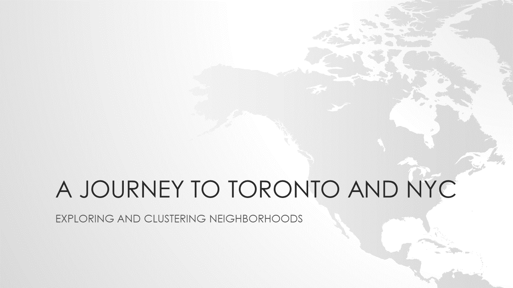

# A JOURNEY TO TORONTO AND NYC

- Problem Description
  - Say you live in the city of Toronto in Canada. You love your neighborhood, mainly because of all the great amenities and other types of venues that exist in the neighborhood,  such as gourmet fast food joints, pharmacies, parks, graduate schools and so on. Now say you decide to reside in the city of New York in USA (or vice versa).
  - Wouldn't it be great if you are able to determine neighborhoods in the other city that are the same as current neighborhood in your city, and if not, perhaps similar neighborhoods.
- Objective 
  - The aim of this project is to study and analyze the neighborhoods of Toronto city and Queens in New York city and group them into similar clusters and, to analyze those
clusters to gather meaningful information. That information can be used to find out neighborhoods that are same as your current neighborhood or at least similar.

